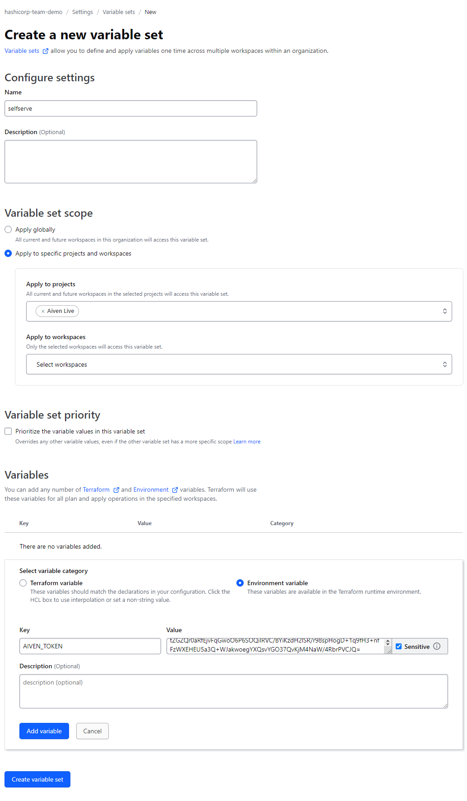

# Example showing how to use OPA with Terraform Cloud to enable self service infrastructure

This example shows how to use OPA with Terraform Cloud to enable self service infrastructure.

To use this example you will need to have an Aiven account and a Terraform Cloud account.
You will also need to fork this repository into your own organization.


## Configuring credentials in Terraform Cloud

Variable sets are used to store credentials in Terraform Cloud. They enable you to store 
client secrets and other sensitive information securely and use them in your Terraform runs. 

To configure a variable set, navigate to the Terraform Cloud UI and select the organization you want to configure. 

```
https://app.terraform.io/app/[your org]/settings/varsets
```

Click the "Create variable set" button and create a variable set called "selfserve". 


The variable set can be set to a scope that limits it to certain workspaces or projects. In this example we are restricting
the variable set to the "Aiven Live" workspace.

You then need to add a variable called `AIVEN_TOKEN` with the value of your Aiven token. This variable should have the
the following properties.

1. Category: Environment variable - This means the variable will be set as an environment variable in the Terraform run.
1. Sensitivity: true - This means the variable will not be visible via the UI or API once saved.



Click the "Create variable set" button to save the variable set.


## Configuring the OPA policy set in Terraform Cloud

The folder `opa` contains the OPA policy that will be used to enforce the self service policy.
This policy checks that only certin Aiven services can be created and that the plan is restricted to
a certain size.

To enforce this policy in Terraform Cloud, you need to create a policy set. 
Navigate to the Terraform Cloud UI and select the organization you want to configure.
In settings you can click the "Policy sets" link.

```
https://app.terraform.io/app/[your org]/settings/policy-sets
```

Click the "Create policy set" button and create a policy set called "selfserve".


Choose your VSC provider.


And then choose the repository where you forked this example.


Next you need to configure the policy set, first ensure that the "Policy framework" 
is set to "Open Policy Agent".

Then you can set the name of the policy to "selfserve".

In the "More options" settings set the path to the policy to "opa/selfserve.rego".
This is the same path as the policy in the repository.

Like variable sets policy sets can be applied only to certina workspaces or projects. 
In this example we are restricting the policy set to the "Aiven Live" project.

Finally you can click the "Connect policy set" button to save the policy set.


Whenever a Terraform run is triggered in the "Aiven Live" project, the policy will 
be evaluated and the run will fail if the policy is violated.


## Configuring the Terraform Cloud workspace

Once you have added the variable set and the policy set you can configure the 
Terraform Cloud workspace.

This repo contains an example Terraform configuration that creates an Aiven PostgreSQL service.

To configure the workspace, navigate to the Terraform Cloud UI and select the organization you want to configure.
Then select the "Projects and Workspaces" and click the "Create a workspace" button.


Then choose the "Version control workflow" option, this will mean Terraform cloud will
run a plan every time a commit is pushed to the repository.


Choose your VCS provider.


Select the repository where you forked this example.


Then you can configure the workspace. The only default option you need to change
for this example is the "Workspace Settings" which is under "Advanced options".

In the "Workspace Settings" you need to set the "Terraform Working Directory" to `/app_terraform`.

Once this is done, click th "Create" button to save the workspace.


Once the workspace is created you can queue a plan by clicking the "Start new plan" button.


After a few seconds Terraform cloud will start to run the plan, the Token needed to
access the Aiven API is automatically injected from the "Variable Set" that you configured
in the first step.

After the plan has executed the "Policy Check" will be run, this will evaluate the output
of the plan against the defined policy. You will see that this plan fails because the
plan for the `aiven_pg` resource is `startup-8` which is out of policy.


## Provisioning NoCode self service workspaces

The Terraform cloud plus teir allows you to create workspaces that can be provisioned
by users without the need for them needing to write any Terraform code.

You provision a module as a NoCode module and the user can then create a workspace
from this module only needing to configure the inputs.

### Creating the Terraform module

To create a NoCode module you need to create a Terraform module and register it
in the Terraform Cloud module registry.

This repo contains an example Terraform module that creates an Aiven PostgreSQL service.
To use with with the module registry you need to create a new Git repository and
copy the contents of the `module/psql` folder into the new repository.

Create a new folder and initialize a new Git repository. The name of the repository
is important as it will be used as the name of the module in the registry.

You need to follow the convention `terraform-[provider]-[name]` where `[provider]` 
is the name of the main provider and `[name]` is the name of the module.

```shell
cd /path/to/myterraform
mkdir terraform-aiven-psql
cd terraform-aiven-psql
git init
```

Then copy the contents of the `module/psql` folder into the new repository.

```shell
cp -r /path/to/aiven_live/module/psql/* .
```

Then you can commit the files to the repository.

```shell
git add .
git commit -m "Initial commit"
```

Terraform cloud uses Tags to determine the versions of a module, so you need to create
a tag for your module.

```shell
git tag 1.0.0
```

Next you need to create a repository in your VCS provider..


And then push the repository to the remote.

```shell
git remote add origin git@github.com:nicholasjackson/terraform-aiven-psql.git
git push -u origin main
git push --tags
```

### Registering the module in the Terraform Cloud module registry

Once this is done you can register the module in the Terraform Cloud module registry.

Click the "Registry" link in the Terraform Cloud UI.

Then click the "Publish Module" button.


Choose your VCS provider.


Select the repository that you just created.


Then you can configure the module. The only default option you need to change
is the checkbox for "No-code provisioning".


Once the module has been added you can now configure it for no-code provisioning.


The settings allow you to add defaults that can be selected when creating a workspace
from this module. This example only allows the user to use a sinnle Aiven project
and restricts the service to a single region. The plan is also restricted to a single
type.

All the other options such as the `db_name`, `service_name` are freeform inputs that
the user can specify.


Once this has been saved you can go back to the `Registry` and select the new module.


Then click the "Provision workspace" button.


The options that can be configured are restricted to the options that you configured
in a previous step. Complete the missing options and click the "Next workspace settings" button.


Finally you can configure the defaults for the workspace such as the name and the
project that you would like it created in.

Selecting the "Auto Apply" button means that the infrastructure will be provisioned
automatically without the need for a user to manually apply the plan.

Once complete click the "Create workspace" button to provision your infrastructure.

